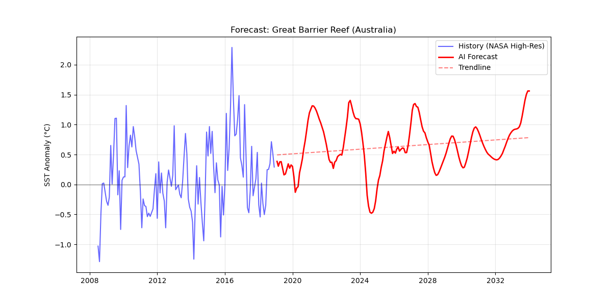

# BlueEco 🌊

**BlueEco** is an AI-powered marine ecosystem intelligence system designed to forecast biological habitability under climate stress. 

Unlike traditional oceanographic models that focus solely on temperature prediction, BlueEco models ecosystems as **thermodynamic systems governed by energy balance**. By quantifying the relationship between metabolic energy demand and biological energy supply, BlueEco moves beyond reactive climate monitoring and into proactive ecosystem survival forecasting.

---

## 🔬 Core Scientific Principle: The Metabolic Squeeze

BlueEco is fundamentally built on the concept of the **Metabolic Squeeze**, which reframes ecosystem collapse as an energy imbalance problem.

*   **Energy Demand (Thermal Forcing):** As sea temperatures rise, the metabolic rates of marine organisms increase exponentially (according to the Q₁₀ rule). This means increased respiration rates, higher caloric requirements, and accelerated biological stress—driven primarily by Sea Surface Temperature (SST).
*   **Energy Supply (Biological Productivity Collapse):** Simultaneously, warming oceans create thermal stratification, which prevents nutrient upwelling. This leads to a decline in phytoplankton populations and reduced primary productivity, cutting off the food web's energy supply. This supply is tracked using **Chlorophyll-a** (productivity proxy) and **POC** (biomass proxy).

### The Collapse Condition
An ecosystem enters the **Metabolic Squeeze Zone** when:  
`Energy Demand > Energy Supply`

In this state, organisms cannot meet their energy requirements, starvation occurs before lethal temperature thresholds are reached, and ecosystem failure becomes inevitable.

---

## 🧠 End-to-End AI System Architecture

BlueEco is implemented as a multi-stage AI pipeline, integrating data engineering, temporal forecasting, and ecological modeling. We use NASA satellite-derived oceanographic data (SST, PAR, Kd490) and atmospheric CO₂ data to introduce climate forcing context.

### Stage 1: Physical Forecasting (Bi-LSTM)
A Bidirectional LSTM network learns temporal dependencies, climate trends, and multi-variable interactions. It performs recursive forecasting across a 10-year horizon (120 months) to predict future physical conditions.

### Stage 2: Biological Modeling (XGBoost)
Two independent XGBoost regression models translate the forecasted physical environment into biological reality by predicting:
1.  **Chlorophyll-a:** Ecosystem productivity
2.  **Particulate Organic Carbon (POC):** Biomass availability

### 🚨 Collapse Detection & Risk Modeling
The system employs a rule-based anomaly detection layer to identify the **Bleaching Risk Index**. A collapse condition is flagged when `SST > 30°C` and `Chlorophyll < 80% of baseline`.

---

## 📊 Results & Visual Analytics

BlueEco translates these complex predictions into actionable visual intelligence. Below are the key outputs from our analysis of the **Great Barrier Reef**:

### The Final Ecosystem Forecast

### Stage 2 Final Research Highlights

Our advanced visualizations map out the biological thresholds of the ecosystem.

#### 1. Productivity & Energy Balance

**Chlorophyll Forecast:** Tracking the decline in primary productivity as temperatures rise.

**Energy Balance:** The divergence between metabolic demand and available energy.

#### 2. Ecosystem Trajectory

**Metabolic Gap:** Quantifying the energy deficit triggering ecosystem collapse.

**Productivity Timeline:** The long-term projection of ecosystem viability.

#### 3. Tipping Points & Stress Analysis

**Quadrant Matrix:** Phase space evolution showing the ecosystem's trajectory toward instability.

**Stress Matrix:** Highlighting the nonlinear collapse boundaries driven by thermal and nutritional stress.

---

## 🌍 Impact and Applications

BlueEco represents a paradigm shift in environmental intelligence. By capturing both temporal and nonlinear relationships, and explicit climate forcing, we can accurately predict real survival dynamics. 

**Applications include:**
*   **Marine Conservation:** Identifying future safe zones and enabling dynamic Marine Protected Areas (MPAs).
*   **Coral Restoration:** Avoiding restoration efforts in collapse-prone regions.
*   **Fisheries Management:** Predicting food web collapse early to prevent economic shocks.

> *BlueEco transforms marine conservation from reactive observation to predictive intervention, enabling decision-makers to act before collapse occurs.*
